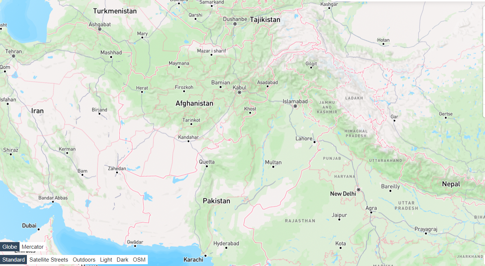

# Climate Data Analysis

  

## Objective
The objective is to analyse the temperature and rainfall patterns in Pakistan from 1995 to 2016 Challenge

## Resources
Data: - [Climate Data](https://opendata.com.pk/)

## Results
From 1995 to 2016, Pakistan's mean temperature was 15°C and rainfall 25 mm. Most rainfall occurred during the monsoon season (June-September). There were temperature recording errors from March to May. Rainfall slightly increased, possibly due to global warming.
